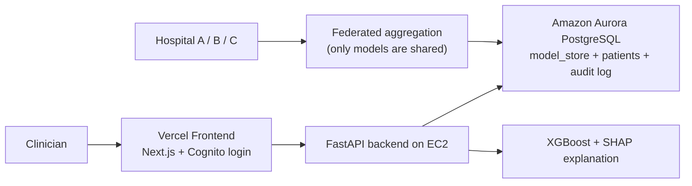

# 🏥 Sammy

Privacy-preserving federated learning for 30-day hospital readmission prediction.

The trained model stays inside the hospital data stack, and patient records never leave the secure backend.


## Live demo

**App:** https://hospital-readmission-prediction-wit-xi.vercel.app/

Sammy includes a realistic login flow and a synthetic demo experience, so the UI remains usable even when the live backend is offline.

## What is Sammy?

Sammy predicts a patient’s risk of 30-day readmission using a federated learning workflow. Each hospital trains on its own data, and only model updates are combined centrally. The frontend then shows the prediction alongside a SHAP explanation so clinicians can see why a risk score was produced.

## Why this design?

Healthcare data is sensitive, and moving raw patient records between hospitals creates privacy and compliance problems. Sammy keeps the data local, sends only model logic across the federation, and uses a secure backend pipeline for inference and auditability.

## Architecture



## Features

- Secure clinician login flow with AWS Cognito and email OTP support.
- Readmission risk scoring for a patient cohort and individual patient detail pages.
- SHAP-based explanations that show which factors increase or decrease risk.
- Demo data fallback so the UI still works without a live backend connection.
- Federated learning workflow where hospitals keep their raw data local.
- Database-backed model storage and prediction audit logging.

## Tech stack

| Layer | Technologies |
| --- | --- |
| Frontend | Next.js, React, TypeScript, Tailwind CSS, Framer Motion, react-three-fiber |
| Auth | AWS Cognito, AWS Amplify, Amazon SES |
| Backend | FastAPI, Uvicorn, psycopg2 |
| ML | XGBoost, SHAP, scikit-learn, pandas, NumPy, Flower |
| Database | Amazon Aurora PostgreSQL |
| Infra | AWS EC2, VPC, Elastic IP, Caddy, systemd |
| Deployment | Vercel for the frontend |

## Repository structure

```text
.
├── frontend/                # Next.js clinician dashboard
│   ├── src/app/             # routes: login, patients, patient detail
│   ├── src/components/      # UI, charts, risk gauges, patient cards
│   └── src/lib/             # auth, API helpers, demo data, types
├── backend/                 # FastAPI inference and training utilities
│   ├── api.py               # inference API
│   ├── model.py             # readmission model wrapper
│   ├── server.py            # federated aggregation entry point
│   ├── client.py            # hospital-side training client
│   ├── schema.sql           # Aurora schema
│   └── upload_model.py      # push model into Aurora
└── vercel.json              # Vercel build configuration
```

## Run locally

### Frontend

```bash
cd frontend
npm install
npm run dev
```

If you want to point the UI at a backend, create a `.env.local` file in `frontend/` with:

```bash
NEXT_PUBLIC_API_URL=https://your-backend-domain
NEXT_PUBLIC_COGNITO_USER_POOL_ID=your_user_pool_id
NEXT_PUBLIC_COGNITO_CLIENT_ID=your_client_id
```

### Backend

```bash
cd backend
python -m venv venv
venv\Scripts\activate
pip install fastapi uvicorn psycopg2-binary xgboost shap pandas numpy scikit-learn
set AURORA_PASSWORD=your-db-password
uvicorn api:app --host 0.0.0.0 --port 8000
```

## Privacy note

Real patient data is not stored in this repository. The public demo uses synthetic records, and the federated design keeps raw hospital data inside each hospital boundary.

## Deployment notes

- The frontend is deployed through Vercel.
- The repo includes `vercel.json` so Vercel builds the `frontend/` workspace correctly.
- The project is configured to use the patched Next.js 15.5.23 release.
